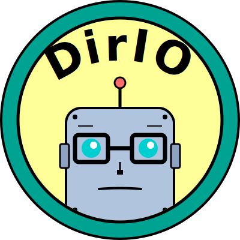

# DirIO - Filesystem-first S3

**Objects on the outside. Directories on the inside.
A filesystem-native S3-compatible object store.**

<p align="center">
  
</p>

DirIO is an S3-compatible object storage server where objects are just files on disk. No chunking, no encoding, no abstraction layers—just directories and files.

Built as a drop-in replacement for MinIO's discontinued single-node filesystem mode.

## Philosophy

- Objects are files. Buckets are directories. That's it.
- No database. Metadata lives in simple JSON files.
- One binary. One data directory. Zero ceremony.
- Import your existing MinIO data and keep going.

## What DirIO Does

- Serves S3 API requests over HTTP
- Stores objects as regular files in `buckets/`
- Maintains metadata in `.metadata/` (JSON files)
- Imports from MinIO's `.minio.sys/` on first boot
- Runs in a container on your NAS

## What DirIO Doesn't Do

- Distributed storage / clustering
- Built-in replication
- Advanced S3 features (yet)
- Replace production-grade S3 implementations

## Quick Start

```bash
# Build
go build -o dirio-server ./cmd/server

# Run
./dirio-server --data-dir /path/to/data --port 9000

# Test
aws --endpoint-url http://localhost:9000 s3 mb s3://test
aws --endpoint-url http://localhost:9000 s3 cp file.txt s3://test/
```

See [QUICKSTART.md](QUICKSTART.md) for detailed setup.

## Directory Layout

```
/data/
├── .metadata/             # DirIO metadata (JSON)
│   ├── users.json         # Credentials
│   ├── policies.json      # Policy definitions  
│   ├── buckets/           # Per-bucket config
│   └── .import-state      # MinIO import tracking
├── .minio.sys/            # MinIO metadata (read-only)
└── buckets/               # Actual objects
    └── mybucket/
        └── path/to/file.jpg
```

Objects in `buckets/` are regular files. Nothing special.

## Supported Operations

| Category | Operations |
| -------- | ---------- |
| Objects  | GET, PUT, HEAD, DELETE, LIST, COPY, Multipart Upload |
| Buckets  | CREATE, DELETE, HEAD, LIST, GetLocation, Policy (GET/PUT/DELETE) |
| Metadata | Custom metadata, Object tagging |
| Advanced | Presigned URLs, Range requests |

## IAM & Authorization

DirIO uses a **hybrid IAM approach** combining the best of S3 and MinIO:

**S3 API Layer (Data Plane):**
- Bucket policies with AWS-standard actions (`s3:GetObject`, `s3:PutObject`)
- Policy conditions (IpAddress, StringEquals, DateLessThan, etc.)
- Policy variables (`${aws:username}`, `${aws:SourceIp}`)
- UUID-based ownership (AWS-like implicit permissions)
- Result filtering (ListBuckets/ListObjects based on permissions)

**MinIO Admin API (Control Plane):**
- User management via `mc admin user add/remove/list`
- Policy management via `mc admin policy create/attach`
- Compatible with MinIO `mc` client

**Shared Backend:**
- Unified IAM metadata in `.dirio/iam/`
- S3-standard PolicyDocument format
- Thread-safe policy evaluation engine

**What's Supported:**
- ✅ S3 bucket policies (AWS CLI, boto3, MinIO mc)
- ✅ MinIO Admin API (`mc admin` commands)
- ❌ AWS IAM API (`aws iam` - explicitly not supported)
- ❌ Terraform AWS provider (requires AWS IAM API)

See [docs/IAM-ARCHITECTURE.md](docs/design/IAM-ARCHITECTURE.md) for complete details.

## MinIO Migration

Point DirIO at your existing MinIO data directory. It will:

1. Find `.minio.sys/`
2. Import users, bucket policies, and object metadata
3. Write to `.metadata/` (your MinIO files stay untouched)
4. Track import state to detect changes

You can switch back to MinIO anytime. The `buckets/` directory is shared.

## Use Cases

- **Homelab NAS storage**: Host S3 buckets on your NAS without MinIO overhead
- **Static site assets**: Serve website media files via S3 API
- **Backup targets**: Use S3-compatible tools with local filesystem storage
- **Development**: Test S3 integrations locally with real files

## Contributing & Development

See [CONTRIBUTING.md](CONTRIBUTING.md) for contribution guidelines and [DEVELOPMENT.md](docs/DEVELOPMENT.md) for project structure, build setup, and architecture notes.

## License

MIT - See [LICENSE](LICENSE)
