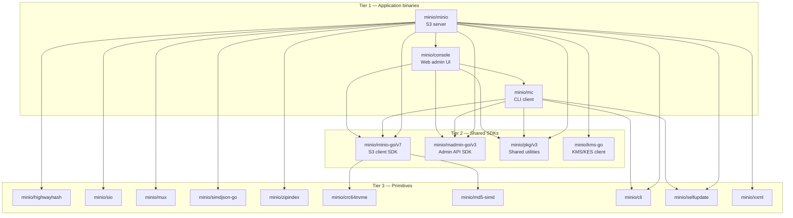
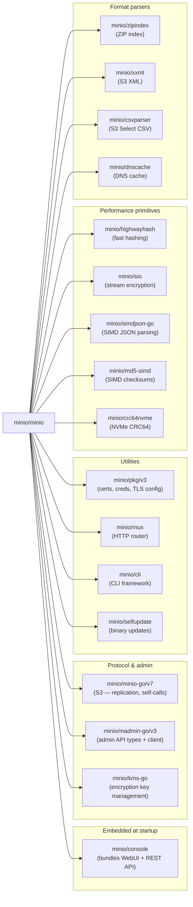
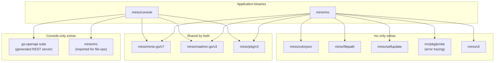
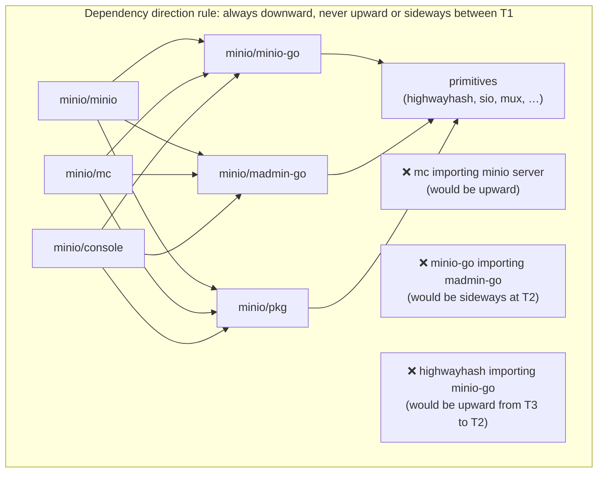
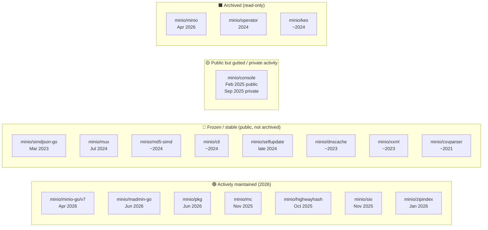

# MinIO Dependency Diagrams

> Mermaid-compatible diagrams. Render with any Mermaid viewer, GitHub markdown preview,
> or paste into https://mermaid.live

---

## Diagram 1 — Full ecosystem overview (three tiers)

Shows the three-tier architecture: application binaries → shared SDKs → primitives.
Arrows represent "imports / depends on."

---

## Diagram 2 — Server import detail

What `minio/minio` imports from the minio org, annotated by purpose.

---

## Diagram 3 — Shared SDK cross-imports

Shows exactly which packages `minio/console` and `minio/mc` share vs. what is unique to each.

---

## Diagram 4 — Acyclic dependency rule

Demonstrates the one-direction constraint that prevents circular dependencies.

---

## Diagram 5 — Current repo lifecycle status

Maps each repo to its current maintenance state.

